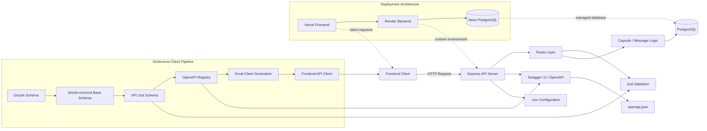

# 사부작 백엔드

<div align="center">


</div>

사부작의 타임캡슐 생성, 조회, 수정, 삭제와 익명 메시지 작성을 담당하는 Express + TypeScript 기반 백엔드 서버입니다.  
Zod 기반 입력 검증, OpenAPI 문서 생성, PostgreSQL 연동을 중심으로 MVP API를 구성하고 있습니다.

## Overview

> "미래의 나와 우리에게 남기는 메시지"

사부작은 특정 시점에 열리는 타임캡슐을 만들고, 그 안에 익명 메시지를 모아 공개 시점 이후 함께 확인하는 서비스입니다.  
이 저장소는 프론트엔드와 협업하기 위한 REST API, OpenAPI 문서, 로컬 개발 환경 구성을 포함합니다.

## Live Links

| Service    | URL                                                                                                    |
| ---------- | ------------------------------------------------------------------------------------------------------ |
| Frontend   | [webfull-9-10-sabujak-fe.vercel.app](https://webfull-9-10-sabujak-fe.vercel.app/)                      |
| Swagger UI | [webfull-9-10-sabujak-be.onrender.com/api-docs](https://webfull-9-10-sabujak-be.onrender.com/api-docs) |

## Key Features

- 타임캡슐 생성 및 공개 시점 기반 상태 관리
- 슬러그 예약 기반 중복 방지 흐름
- 공개 전/후 단일 조회 API 제공
- 익명 메시지 작성 및 닉네임 중복 제어
- Swagger UI와 OpenAPI JSON 제공
- Docker Compose 기반 로컬 개발 환경 지원

## Tech Stack

| Category   | Stack                                        |
| ---------- | -------------------------------------------- |
| Runtime    | Node.js 20+, TypeScript                      |
| Server     | Express 5                                    |
| Validation | Zod                                          |
| API Docs   | `@asteasolutions/zod-to-openapi`, Swagger UI |
| Database   | PostgreSQL, Redis                            |
| Tooling    | pnpm, ESLint, Prettier, Husky                |
| Infra      | Docker Compose                               |

## Architecture



사부작 백엔드는 프론트엔드 요청을 Express 서버에서 받아 Zod로 검증하고, 캡슐 및 메시지 도메인 로직을 거쳐 PostgreSQL에 저장합니다.  
추가로 `Drizzle -> drizzle-orm/zod -> API Zod -> OpenAPI -> Orval`로 이어지는 스키마 파이프라인과 `Vercel -> Render -> Neon` 배포 흐름을 함께 보여주도록 구성했습니다.

## Schema Layering

현재 스키마 구성은 `src/db/schema.ts`를 단일 진실 공급원으로 두고, `drizzle-orm/zod`로 DB base schema를 생성한 뒤 API DTO가 이를 재사용하는 방식입니다.

- DB base schema
  - 위치: `src/db/schema.ts`
  - 역할: 컬럼 길이, null 여부, 기본 타입, slug 정규식 같은 공통 도메인 제약의 기준점
- API schema
  - 위치: `src/modules/*/dto/*.ts`
  - 역할: 요청/응답 계약, OpenAPI example, path/body 분리, `isOpen`, `messageCount`, `messages`, `password`, `reservationToken` 같은 API 전용 필드 표현

실무 규칙은 다음처럼 유지합니다.

- 공통 필드는 가능하면 DB base schema에서 `pick`, `omit`, `extend`, `partial`로 가져옵니다.
- API에만 존재하는 필드는 DTO 레이어에서만 선언합니다.
- 시간 필드는 DB에서는 `timestamp`이지만 API 계약은 UTC ISO 8601 문자열이므로 DTO에서 문자열 스키마를 유지합니다.
- OpenAPI example과 설명은 최종 DTO schema root에 붙여 문서 계약을 명확히 유지합니다.

## Project Structure

```text
.
├── src
│   ├── app
│   ├── openapi
│   ├── schemas
│   └── index.ts
├── docs
│   ├── API_SPEC.md
│   ├── ERD.md
│   └── MOCK_API_SPEC.md
├── scripts
├── openapi.json
├── docker-compose.yml
└── README.md
```

## Documents

- [API 명세서](./docs/API_SPEC.md)
- [ERD](./docs/ERD.md)
- [DB 스키마 가이드](./docs/db-guide.md)
- [Mock API 명세서](./docs/MOCK_API_SPEC.md)
- [OpenAPI JSON](./openapi.json)
- [QA 보고서 위치 안내](./docs/reports/README.md)

## Artifact Ownership

| 산출물                              | 정본 위치                       | 설명                                    |
| ----------------------------------- | ------------------------------- | --------------------------------------- |
| 백엔드 unit/integration 테스트 코드 | 백엔드 레포                     | 구현과 함께 변경되는 검증 자산          |
| 백엔드 기술 문서                    | 백엔드 `docs/`                  | 아키텍처, API, 스키마 문서              |
| 블랙박스 QA 결과 보고서             | QA 레포 `docs/reports/backend/` | smoke/regression, 장애보고서, 대응 계획 |

## Development Workflow

1. 기능 요구사항을 기준으로 `docs/API_SPEC.md`와 필요 시 `docs/ERD.md`를 먼저 갱신합니다.
2. DB 스키마는 `src/db/schema.ts`와 `drizzle/*`만 정본으로 관리하고, `pnpm run db:generate -> db:migrate -> db:schema:export -> db:schema:check` 순서로 반영합니다.
3. `docs/schema.sql`은 Drizzle 기준 참조 스냅샷이며 직접 실행하지 않습니다.
4. 배포 환경에서는 앱 기동 전에 운영 `DATABASE_URL` 기준 `pnpm run db:migrate`를 먼저 실행하고, 서버 시작이 migration을 대체하지 않도록 유지합니다.
5. 서버 라우트와 도메인 로직을 구현한 뒤 OpenAPI 산출물을 생성하거나 검증합니다.
6. 생성된 OpenAPI 스펙을 기준으로 프론트엔드에서 Orval 클라이언트를 연동해 API 타입과 호출 코드를 동기화합니다.
7. Swagger UI, 로컬 실행, 배포 환경(Render/Neon)에서 최종 동작을 확인합니다.

## Getting Started

### 1. Prerequisites

- Node.js `20+`
- pnpm `8+`
- Docker / Docker Compose

### 2. Install Dependencies

```bash
pnpm install
```

### 3. Configure Environment Variables

```bash
cp .env.example .env
```

필요 시 `.env`에서 포트, DB 연결 정보, CORS 허용 출처를 프로젝트 환경에 맞게 수정합니다.

### 4. Run with Docker Compose

```bash
docker compose up --build
```

기본적으로 API 서버, PostgreSQL, Redis가 함께 실행됩니다.

### 5. Run Locally

DB와 Redis가 준비되어 있다면 아래 명령으로 개발 서버를 실행할 수 있습니다.

```bash
pnpm run dev
```

## Available Scripts

| Command                           | Description                   |
| --------------------------------- | ----------------------------- |
| `pnpm run dev`                    | 개발 서버 실행                |
| `pnpm run build`                  | 프로덕션 번들 생성            |
| `pnpm run start`                  | 빌드 결과 실행                |
| `pnpm run typecheck`              | 타입 검사                     |
| `pnpm run lint`                   | 린트 검사                     |
| `pnpm run lint:fix`               | 린트 자동 수정                |
| `pnpm run db:generate`            | Drizzle migration 생성        |
| `pnpm run db:migrate`             | Drizzle migration 적용        |
| `pnpm run db:schema:export`       | `docs/schema.sql` 스냅샷 갱신 |
| `pnpm run db:schema:check`        | DB 스키마 워크플로우 검증     |
| `pnpm run db:repair:legacy-drift` | legacy drift 수동 복구        |
| `pnpm run openapi:generate`       | OpenAPI 문서 생성             |
| `pnpm run openapi:check`          | OpenAPI 산출물 검증           |
| `pnpm run test:rate-limit`        | rate limit 관련 스크립트 실행 |

## API Entry Points

로컬 실행 기준 주요 접근 경로입니다.

| Path            | Description            |
| --------------- | ---------------------- |
| `/`             | 기본 확인용 엔드포인트 |
| `/healthCheck`  | 서버 상태 확인         |
| `/openapi.json` | OpenAPI 스펙           |
| `/api-docs`     | Swagger UI             |
| `/capsules/*`   | 타임캡슐 관련 API      |

## Environment Variables

자세한 예시는 [`.env.example`](./.env.example)에 정리되어 있습니다.

| Variable                   | Description                     |
| -------------------------- | ------------------------------- |
| `NODE_ENV`                 | 실행 환경                       |
| `API_PORT`                 | API 서버 포트                   |
| `POSTGRES_USER`            | 로컬 PostgreSQL 계정            |
| `POSTGRES_PASSWORD`        | 로컬 PostgreSQL 비밀번호        |
| `POSTGRES_DB`              | 로컬 PostgreSQL DB 이름         |
| `DATABASE_URL`             | DB 연결 문자열                  |
| `REDIS_URL`                | 로컬 Redis 연결 문자열          |
| `CORS_ORIGIN`              | 허용할 CORS origin 목록         |
| `CHOKIDAR_USEPOLLING`      | Docker 개발 환경 파일 감시 옵션 |
| `UPSTASH_REDIS_REST_URL`   | Upstash Redis REST URL          |
| `UPSTASH_REDIS_REST_TOKEN` | Upstash Redis REST 토큰         |

## Team

| 프로필                                                          | 이름   | 역할     | GitHub                                                 |
| --------------------------------------------------------------- | ------ | -------- | ------------------------------------------------------ |
|      | 이윤하 | Backend  | [@labyrinth30](https://github.com/labyrinth30)         |
|         | 김인수 | Backend  | [@insu1170](https://github.com/insu1170)               |
|          | 한재민 | Frontend | [@s576air](http://github.com/s576air)                  |
|  | 송창욱 | Frontend | [@supersoldier132](https://github.com/supersoldier132) |
|         | 이연희 | Frontend | [@yomiyoni](https://github.com/yomiyoni)               |

## Collaboration Guide

- API 변경 시 `docs/API_SPEC.md`와 `openapi.json`을 함께 갱신합니다.
- 데이터 모델 변경 시 `docs/ERD.md`와 `docs/db-guide.md` 흐름도 함께 반영합니다.
- DB 변경은 수동 SQL 대신 Drizzle migration만 사용합니다.
- 배포 시 DB migration은 앱 시작 전에 한 번만 실행하고, 서버 재기동으로 스키마를 맞추지 않습니다.
- 외부 입력은 Zod 스키마로 검증하는 규칙을 유지합니다.
- 민감 정보는 `.env.example`이 아닌 실제 `.env` 또는 배포 환경 변수로 관리합니다.

## License

[MIT](./LICENSE)
