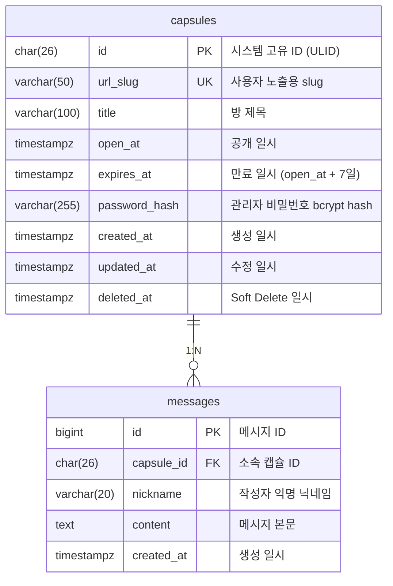

# ERD

## Overview

사부작 서비스의 타임캡슐 방(`capsules`)과 메시지(`messages`) 관계를 정의합니다.

- DB 컬럼명은 `snake_case`를 사용합니다.
- API 응답 필드명은 별도 직렬화 규칙에 따라 `camelCase`로 변환할 수 있습니다.
- 시간 컬럼은 모두 UTC 기준 `timestamptz`를 사용합니다.

## Mermaid ER Diagram

## Entities

### capsules

| Field      | Type         | Key   | Description                 |
| ---------- | ------------ | ----- | --------------------------- |
| id         | char(26)     | PK    | 시스템 고유 ID (ULID)       |
| url_slug   | varchar(50)  | UK    | 사용자 지정 커스텀 URL      |
| title      | varchar(100) | -     | 방 제목                     |
| open_at    | timestamptz  | -     | 공개 일시                   |
| expires_at | timestamptz  | INDEX | 만료 일시 (`open_at + 7일`) |
| password   | varchar(255) | -     | 관리자 비밀번호             |
| created_at | timestamptz  | -     | 생성 일시                   |
| updated_at | timestamptz  | -     | 마지막 수정 일시            |

제약 및 규칙:

- `url_slug`는 unique constraint가 필요합니다.
- `expires_at`는 생성 시 계산 저장하며, `open_at` 변경 시 함께 재계산합니다.
- `deleted_at IS NULL`인 행만 활성 캡슐로 간주합니다.

### messages

| Field      | Type        | Key | Description                    |
| ---------- | ----------- | --- | ------------------------------ |
| id         | bigint      | PK  | 메시지 ID (Auto Increment)     |
| capsule_id | char(26)    | FK  | 소속 캡슐 ID                   |
| nickname   | varchar(20) | -   | 작성자 익명 닉네임             |
| content    | text        | -   | 메시지 본문 내용 (최대 1000자) |
| created_at | timestamptz | -   | 생성 일시                      |

제약 및 규칙:

- `capsule_id`는 `capsules.id`를 참조합니다.
- 닉네임은 trim 이후 `1~20자` 길이 제한을 가집니다.
- 내용은 trim 이후 `1~1000자` 길이 제한을 가집니다.
- 같은 캡슐 내에서는 `nickname` 중복을 허용하지 않습니다.
- 이를 위해 `(capsule_id, nickname)` 복합 unique constraint를 둡니다.
- MVP 단계에서는 캡슐당 메시지 최대 `300`건 정책을 애플리케이션 레벨에서 강제합니다.

## Relationships

| From     | Relation | To       | Description                                      |
| -------- | -------- | -------- | ------------------------------------------------ |
| capsules | 1:N      | messages | 하나의 캡슐 방은 여러 메시지를 가질 수 있습니다. |

## Delete Policy

- 운영 API의 캡슐 삭제는 `deleted_at`을 설정하는 Soft Delete입니다.
- Soft Delete만으로는 DB 레벨 `ON DELETE CASCADE`가 실행되지 않습니다.
- 따라서 메시지는 캡슐 Soft Delete 이후에도 물리적으로 남아 있을 수 있으며, 조회 시 애플리케이션 레벨에서 차단합니다.
- 향후 배치 또는 운영 도구로 캡슐을 Hard Delete하는 경우에만 `messages.capsule_id` FK의 `ON DELETE CASCADE` 적용 여부를 선택합니다.

## Recommended Indexes

- `capsules(url_slug)` unique index
- `capsules(expires_at)` index
- `messages(capsule_id, nickname)` unique index
- `messages(capsule_id, created_at)` index

## Notes

- 내부 참조와 조인은 `capsules.id`를 기준으로 수행합니다.
- 사용자 노출 식별자는 `capsules.url_slug`입니다.
- API 문서의 `openAt`, `expiresAt`, `createdAt`, `updatedAt`, `deletedAt`은 각각 DB의 `open_at`, `expires_at`, `created_at`, `updated_at`, `deleted_at`에 대응합니다.
