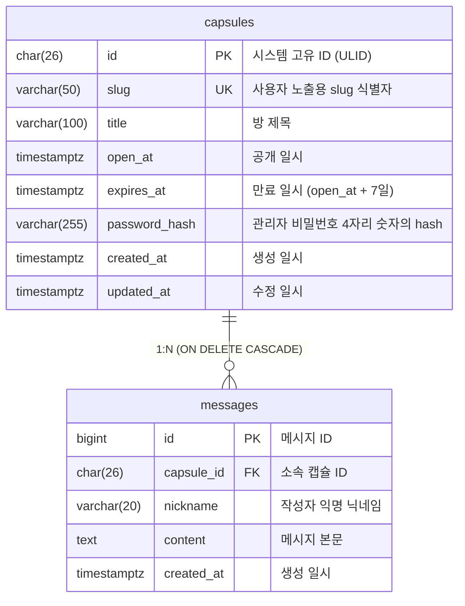

# ERD

## Overview

사부작 서비스의 타임캡슐 방(`capsules`)과 메시지(`messages`) 관계를 정의합니다.

- DB 컬럼명은 `snake_case`를 사용합니다.
- API 응답 필드명은 별도 직렬화 규칙에 따라 `camelCase`로 변환할 수 있습니다.
- 시간 컬럼은 모두 UTC 기준 `timestamptz`를 사용합니다.
- 캡슐 삭제 정책은 Hard Delete입니다.

## Mermaid ER Diagram

## Entities

### capsules

| Field         | Type         | Key   | Description                                              |
| ------------- | ------------ | ----- | -------------------------------------------------------- |
| id            | char(26)     | PK    | 시스템 고유 ID (ULID)                                    |
| slug          | varchar(50)  | UK    | 사용자 지정 커스텀 URL                                   |
| title         | varchar(100) | -     | 방 제목                                                  |
| open_at       | timestamptz  | -     | 공개 일시                                                |
| expires_at    | timestamptz  | INDEX | 만료 일시 (`open_at + 7일`)                              |
| password_hash | varchar(255) | -     | 관리자 비밀번호 4자리 숫자의 hash                        |
| created_at    | timestamptz  | -     | 생성 일시                                                |
| updated_at    | timestamptz  | -     | 마지막 수정 일시 (정보 변경 및 신규 메시지 수신 시 갱신) |

제약 및 규칙:

- `slug`는 unique constraint가 필요합니다.
- `expires_at`는 생성 시 계산 저장하며, `open_at` 변경 시 함께 재계산합니다.
- `password_hash`는 캡슐 관리자용 숫자 4자리 비밀번호 원문을 저장 전 hash 처리한 값을 저장합니다.

### messages

| Field      | Type        | Key | Description                    |
| ---------- | ----------- | --- | ------------------------------ |
| id         | bigint      | PK  | 메시지 ID (Auto Increment)     |
| capsule_id | char(26)    | FK  | 소속 캡슐 ID                   |
| nickname   | varchar(20) | -   | 작성자 익명 닉네임             |
| content    | text        | -   | 메시지 본문 내용 (최대 1000자) |
| created_at | timestamptz | -   | 생성 일시                      |

제약 및 규칙:

- `capsule_id`는 `capsules.id`를 참조합니다.
- 조회 시 기본 정렬은 `id ASC`를 따릅니다.
- 닉네임은 trim 이후 `1~20자` 길이 제한을 가집니다.
- 내용은 trim 이후 `1~1000자` 길이 제한을 가집니다.
- 같은 캡슐 내에서는 `nickname` 중복을 허용하지 않습니다.
- 이를 위해 `(capsule_id, nickname)` 복합 unique constraint를 둡니다.
- MVP 단계에서는 캡슐당 메시지 최대 `300`건 정책을 애플리케이션 레벨에서 강제합니다. (단, 동시 요청 시 301~302건 등 낙관적 예외 허용)

## Relationships

| From     | Relation | To       | Description                                                                                       |
| -------- | -------- | -------- | ------------------------------------------------------------------------------------------------- |
| capsules | 1:N      | messages | 하나의 캡슐 방은 여러 메시지를 가질 수 있으며, 캡슐 Hard Delete 시 연관 메시지도 함께 삭제됩니다. |

## Delete Policy

- 운영 API의 캡슐 삭제는 Hard Delete입니다.
- `messages.capsule_id`는 `capsules.id`를 참조하는 FK를 가지며, `ON DELETE CASCADE`를 적용합니다.
- 따라서 캡슐 삭제 시 연관 메시지는 DB 레벨에서 함께 삭제됩니다.

## Recommended Indexes

- `capsules(slug)` unique index
- `capsules(expires_at)` index
- `messages(capsule_id, nickname)` unique index
- `messages(capsule_id, id)` index

## Notes

- 내부 참조와 조인은 `capsules.id`를 기준으로 수행합니다.
- 사용자 노출 식별자는 `capsules.slug`입니다.
- API 문서의 `slug`, `openAt`, `expiresAt`, `createdAt`, `updatedAt`은 각각 DB의 `slug`, `open_at`, `expires_at`, `created_at`, `updated_at`에 대응합니다.
- 공개 후 캡슐 조회 응답은 별도 메시지 조회 엔드포인트 대신 `messages` 배열을 함께 포함할 수 있습니다.
